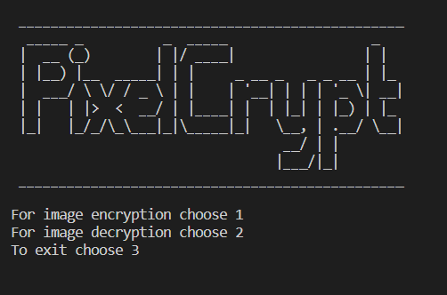

# PixelCrypt

## Image Encryption and Decryption

This is a repository for a Python project that performs image encryption and decryption using a bitwise XOR operation on the pixel values. The project allows users to input an image path and a key to generate a new encrypted or decrypted image file.



## Prerequisites

To run this project, you need to have the following installed:

- Python 3.x: [Download Python](https://www.python.org/downloads/)

## Installation

1. Clone the repository to your local machine using the following command:
    
    ```
    git clone <https://github.com/Daanyal4/PixelCrypt.git>
    
    ```
    
2. Navigate to the project directory:
    
    ```
    cd PixelCrypt
    ```
    

## Usage

1. Run the `main.py` file to start the program.
    
    ```
    python3 main.py
    
    ```
    
2. The program will display a menu with the following options:
    
    ```
    1. Image Encryption
    2. Image Decryption
    3. Exit
    
    ```
    
3. Choose option `1` to encrypt an image.
4. Enter the path to the image file you want to encrypt when prompted.
5. Enter a key for encryption. The key can be any string of characters.
6. The program will encrypt the image using a bitwise XOR operation on each individual pixel value and save the encrypted image as a new file.
7. Choose option `2` to decrypt an image.
8. Enter the path to the encrypted image file you want to decrypt when prompted.
9. Enter the key used for encryption.
10. The program will decrypt the image using the same bitwise XOR operation and save the decrypted image as a new file.
11. Repeat steps 3-10 as desired.
12. Choose option `3` to exit the program.

## Example

Here's an example of how the program flow looks:

```
python main.py

```

```
Image Encryption and Decryption

1. Image Encryption
2. Image Decryption
3. Exit

Choose an option: 1
Enter the path to the image file: /path/to/image.png
Enter the encryption key: mykey

Image encrypted successfully and saved as encrypted_image.png.

Choose an option: 2
Enter the path to the encrypted image file: /path/to/encrypted_image.png
Enter the decryption key: mykey

Image decrypted successfully and saved as decrypted_image.png.

Choose an option: 3
Exiting the program...

```#
